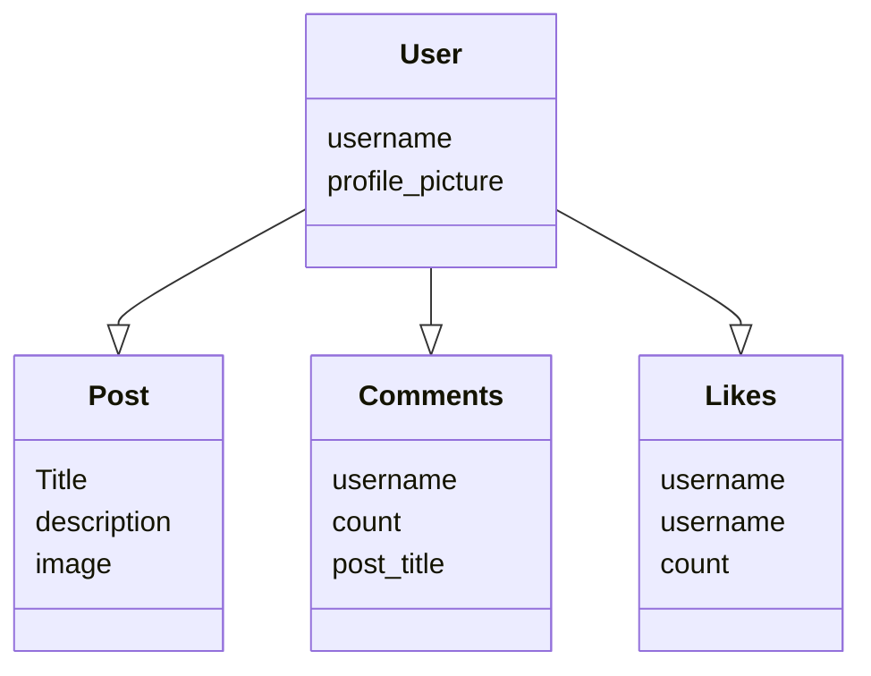
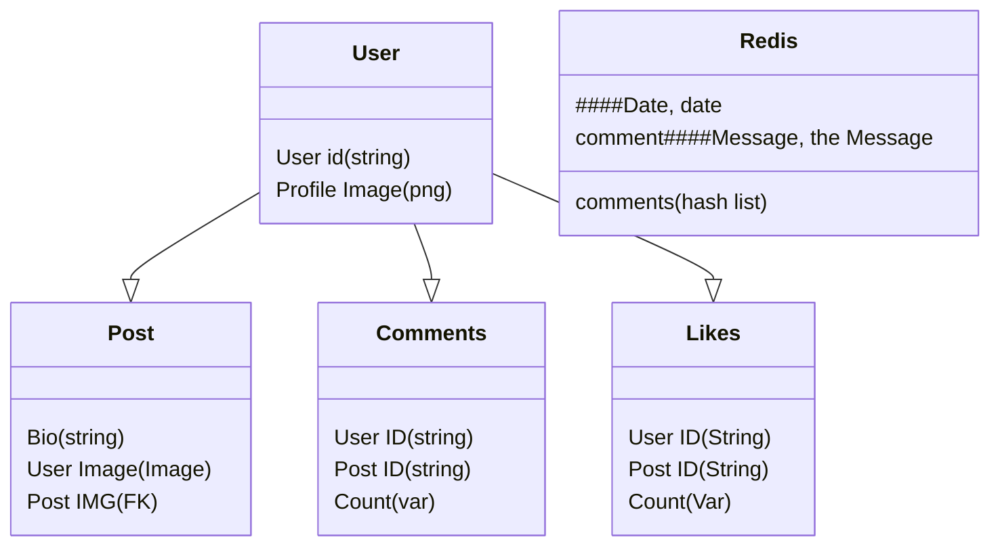

 
 

<!-- _class: lead -->

>### Module 8 | Exercises

# Databases

 

This assignment includes an in-class directive.

In case you missed any of the instructions in the class, please refer to the recording:

 
 

<h1> Logical Diagram</h1>

<!-- checked, completion receipt for exercise 2, i fixed the diagram 1, please fix the diagram 2. -->

 
 
<h1>Physical Diagram</h1>

<html>
  

    <h4>Please don't forget to add "<b>COMPLETED</b>" into your commit description when your assignment is ready for checking.</h4>
  

</html>

 
 
 
